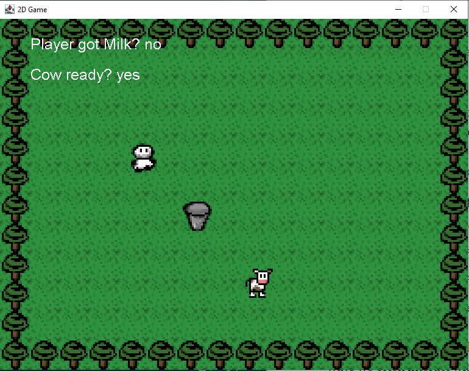

# How to milk a cow

In this little program I used Java and the Swing GUI.

The [player](src/entity/Player.java) can control the little farmer buddy vie WASD or arrow keys and can milk the cow by pressing the spacebar. After milking the cow, the player can bring the milk to the big bucket and fill it by interacting via spacebar.

Most important is the [Gamepanel Script](src/main/GamePanel.java) where I load the panel, create the thread and control all the things to be drawn.

Second there is the [Collision Detector](src/main/CollisionDetector.java) which was most challenging for me. At the start there were a million bugs that are now down to only a few thousands. :wink:
Now the player can push the cow, collides with other objects and stays on screen no matter what.

Another thing I liked is the simple [cow AI](src/entity/Cow.java). The cow moves randomly and changes directions when hitting an obstacle. I would say that my cow is as smart as a real cow now. :cow2:

There would be a lot more to do like make a soil ground that is able to grow a carrot. The 2D-sprites already exist but for now I would like to get engaged in other projects.
